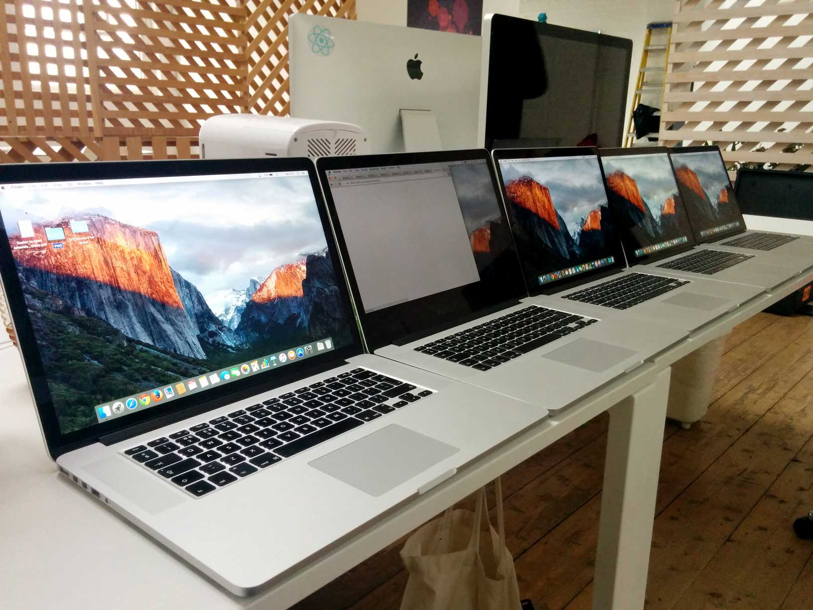
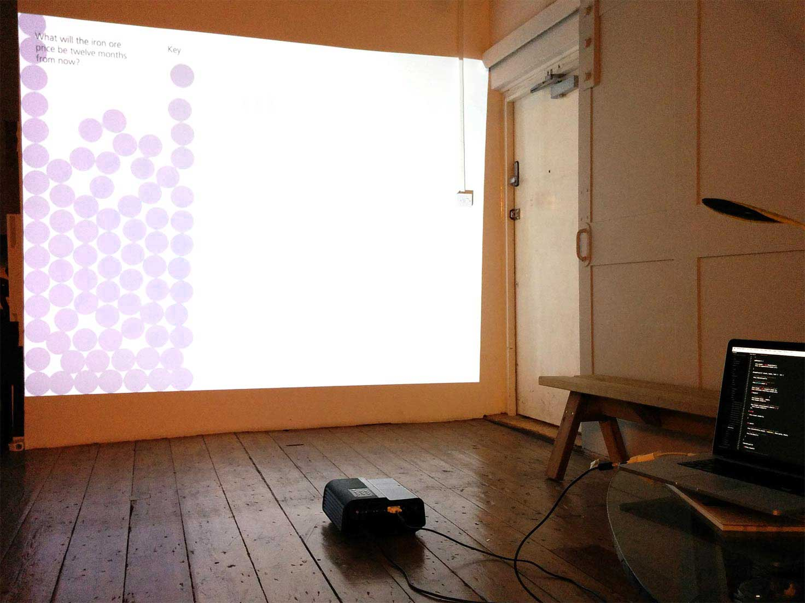
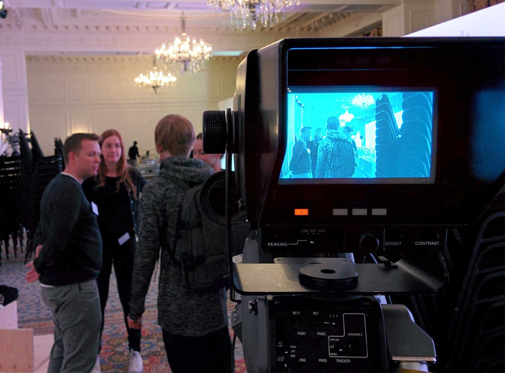

<!-- color: #B4D5FF -->
<!-- description: Collecting insights from conference attendees and showing the results in real time. -->
<!-- description_big: Bank hosted high profile conferences globally for senior investors and corporates. We created a way for them to collect insights from attendees. The results are displayed in real time on visualisations around the event. -->

# Conference visualisations

## Problem
For a global bank, Signal Noise designed looping, screen saver style visualisations which pulled in data and content in real time about the different topics being discussed at the conference. This information would originate from people answering quick questions through iPad kiosks located around the conference.

The iPad kiosks also allowed people to submit their own questions and then if approved, would be presented to other attendees to be answered. This meant the system needed a way for moderators to view submitted questions and approve them as necessary.

## Limitations
We had just two weeks to have it ready for the event. This was a hard deadline as this is when the event was taking place.

The visualisation and kiosk apps had to handle the possibility of the internet connection dropping. Both apps also had to be very robust in handling all sorts of input and interactions that users would throw at it. Having to restart the app wasn’t a possibility.

The kiosk app that took users submissions had to work on iPads used as kiosks that would be active for many hours. Users could also submit questions via the website. This meant the app had to work on Blackberry 10, Windows Phone and Android devices.

## Solutions
The solution was to split up the work of the three apps between three front-end developers, with each working on either the visualisations, kiosk and backend. My focus was the kiosk app.

Five MacBook pros would also be rented for the event. We would then set up machine with the required software.

The visualisation would randomly select animations to play and loop. However, the logic to the selection had to be smart and not completely random so that repeating animations would not appear one after another by chance.

## My Role
### Continuous testing
Testing for the answer submission app was done throughout developing it. It had to work across Android, iOS, Windows Phone and Blackberry as well as in kiosk mode on the iPads at the event. The test strategy was beyond just viewport size. Based on the audience from analytics from the bank.

I chose the devices based on what was the best selling on Amazon. This is because the best selling devices are usually the best for value, and are not high-end phones. They tend more towards lower mid range devices. We got 1 device for each OS as well as using our own phone to test some high-end phones (we all have fancy phones in the office).

<video src="videos/slider.mp4" muted playsinline loop autoplay class="video-window"></video>
*Example of the slider question.*

<video src="videos/multiple.mp4" muted playsinline loop autoplay class="video-window"></video>
*Example of the multple answers question.*

<video src="videos/admin_screen.mp4" muted playsinline loop autoplay class="video-window"></video>
*Admin panel.*

Surprising Blackberry 10 wasn't the hardest device to develop for being that it uses WebKit. It was actually Windows Phones.

For the first conference, there were five different screens to show the visualisation. We rented
five MacBook Pros and installed Apache, PHP and Chrome. I quickly put together a package of files that includes a shell script to install and setup the machines automatically. This was needed because we were still making changes to the code base and needed a way to setup the machines relatively quickly often.

## Late night fixes

We came in on the weekend to spend extra time to get it finished before the conference on Monday. We had a mock setup of a visualisation by putting it on a projector. This was not the accurate physical size the of the displays at the event (they were many times bigger), however by zooming scaling the webpage up it allowed us to view section of the visualisations at approximate size. It also allowed us to test contrast levels and colour of text and graphics then adjust accordingly.

Hours away from midnight on Sunday night when we found a serious bug with the visualisation. Sometimes the visualisation would pause and not break the loop.

## Day of the conference

On the day of the conference, we turned up early to the hotel. We brought with us all the equipment that needed to be set up. We had to go round and set up five machines on various different screens. We were on site for first few conferences to help set up the visualisation and be on call for tech support.

## Lessons learned
### Developers are users too
Since the first conference, there have been over twenty conferences over the last two years. Each with a different set of questions, text and graphics. Over this time I helped onboard new developers to the project (got to increase that [bus factor](https://en.wikipedia.org/wiki/Bus_factor)). During this time I learned what were the main pain points from a development perspective. So this year during some downtime at the studio I spent time to improving the development process. I re-wrote all the documentation to help share knowledge that was only known by word of mouth. Originally the documentation was one page. It has been expanded to thirteen structured pages explaining topics from deployment and conference life cycle.

### Don’t use manual procedures
> "People just aren’t as repeatable as computers. Nor should we expect them to be."
> <cite>Pragmatic programmer, p231</cite>

A major difficulty with the setup was the reliance on Apache and PHP already have been installed with the right configuration on the developer's local machine. I removed this requirement by migrating the project to use Vagrant. This reduced the dependencies down from nine to five and meant that setup was as easy as running 2 commands, `npm install` and `vagrant up`. On any future projects that involve setting up machines consistently, I would invest some time to automate this procedure.

After setting up a conference became more routine, Signal Noise were required less to be on site and just provide support over the phone and email. This meant we could no longer assume people setting up the conference had the knowledge or experience to do so. This led to me creating an installer application that would set up the visualisation machines. This app would disable system functions such as sleep and notifications, and make sure the visualisation opened fullscreen at startup. Some other projects now also require this functionality, so an internal project managed by me called Bigscreen is in development now.
