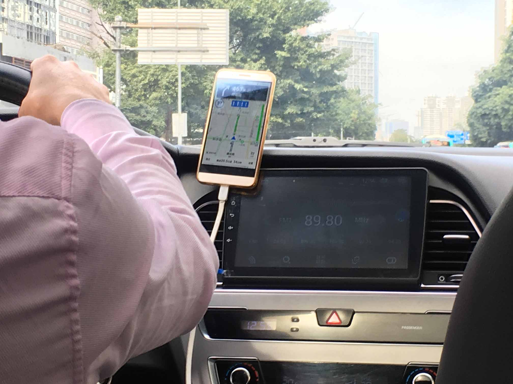
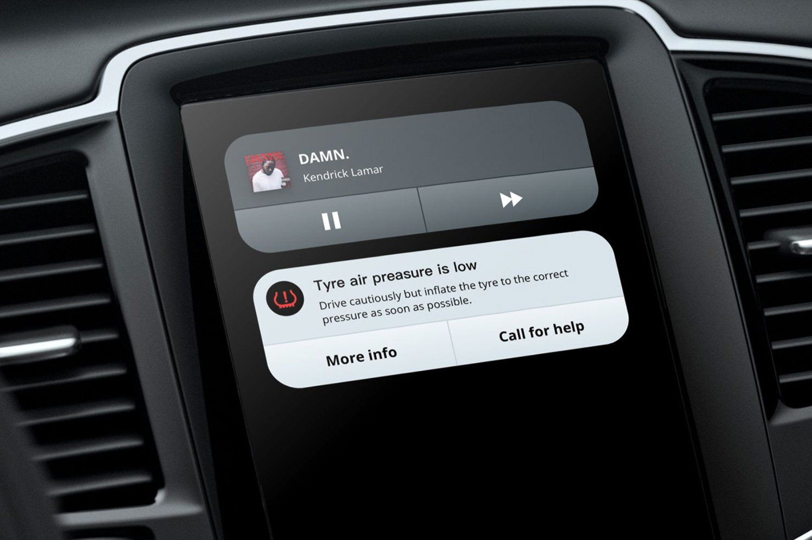
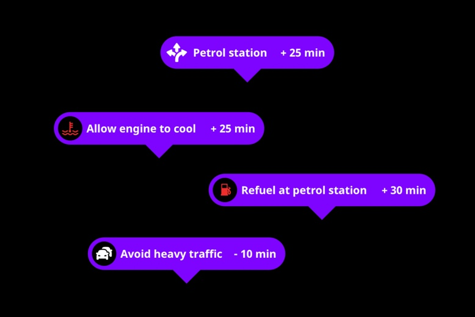
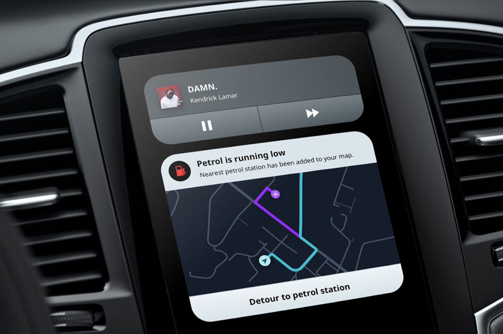

<!-- color: #FFDA2E -->
<!-- description: Improving the in-car dashboard and console (slightly). -->
<!-- description_big: Designing two product features to improve the digital instrument cluster. And doing so without completely re-inventing everything ever. -->

# Improving the in-car dashboard and console (slightly)

During my visit to China I would often take the ride sharing service Didi (China's Uber equivalent). I'd find myself in fancy electric vehicles equipped with digital dashboards and consoles. Yet, all this technology gets replaced with a smartphone on a cheap plastic mount.

Car software is not as compelling or useful enough to replace a smartphone. What is the problem and how can it be improved?

*Forget about disrupting the automotive industry. I'm targeting the cheap plastic mount industry.*

## Problem
There is a trend for digital dashboards in cars. Take the existing physical dashboard and digitise it. They do not take full advantage of the digital display. Except in adding extravagant decoration, menus and animations. This adds to the complexity of the car.

There is a huge opportunity in in-car UI design now. To re-think the dashboard and console we need to ask question; what does a driver need? Two of these requirements are **clarity** and **anticipation**.

*This is digital. Photo from caricos.com*

When the car dashboard was physical, it's immalleable state limited it. Designers and engineers needed to include an array of symbols, gauges and numbers. Even if some were rarely useful. With a digital dashboard, it is infinitely changeable. But digital dashboards today still include warning lights without any explanation. Drivers do not know what they mean. And they shouldn’t need to remember them or refer to a handbook.

<!-- [illustration of car symbols with engine and fuel highlighted] -->

There was a [British study](https://www.livescience.com/38579-drivers-confused-dashboard-lights.html) based on 2000 car drivers. It found that 98% of them did not understand what the most common warning lights meant. The most understood symbols are the ones that appear most often. But the symbols that appear less are the ones that are not as understood. Less frequent symbols are usually the more important ones. The majority of people in the survey said they continued driving for more than a week. Taking an average of 12 days to get their car fixed. This is hazardous.

Some of the icons are deceptively simple, like the engine symbol. Of course it means something is wrong with the engine. But what is wrong with the engine? Imagine if your phone had a problem and just said “check phone”.

And everyone understands the fuel symbol's meaning. But it has a little secret. Do you know what the arrow means? It’s to indicate what side the fuel cap is on. Which is kind of smart, for a physcial dashboard. But somehow gets carried over to the digital world.

*[The best icon is a text label.](https://thomasbyttebier.be/blog/the-best-icon-is-a-text-label)*

<!-- [illustration of computer tooltips, maybe mac doc] -->

Personal computer interfaces have already solved this problem. When was the last time you referred to your computer's owner manual to figure out what an icon meant?

## Solution
The digital dashboard should only include information that is highly relevant to the drivers needs. Information that is glanceable and on demand.

Driving a car is a reactionary experience. When something goes wrong, you react to the problem and treat the symptom. For example, if you are low on fuel you will have to decide what to do. Should I risk driving further, or, do I stop and find the nearest gas station?

Problems are on the driver to deal with. But the car has more information than the driver could ever have.

<!-- [illustration of persons senses vs car. Maybe car with sensors sticking out and equipment] -->

Cars today could take full advantage of a connected world. They are integrated to their various internal sensors. And can connect to external online services. Yet, the integration between both the internal and external is rarely taken advantage of.

With an anticipatory experience, the car can predict and prevent a problem. We can re-look at the low fuel example in a new way. If the driver is following a GPS route to a destination, the car can add a stop to a gas station along their journey. If there are no gas stations enroute, it can suggest actions to take before you even start driving.

Predictions on occasion can and will be wrong. But connected cars can upload their successes and failings to centralised place. And then have machine learning analyse it. And this is only the surface of what a connected and predictive car system could do.

## Implementation
I’ve focused on two key features for the dashboard. Status and Detour. Both these features have the dashboard and console working together in tandem.

This is the dashboard I’ve designed. It’s pretty simple. There is a speedometer on the right side and a status bar at the bottom.

I've kept the speed reading as a dial because in your peripheral vision speed is readable by the of position of the needle. And you can get a sense of the rate of change by the needle's movement. [This paper](https://drive.google.com/file/d/0B2U2YEQghVvQYVVfNVlYTjA3LU0/view) helped me decide that. But the tachometer is gone. In it's place is a map. Which is more important in the rise of electric and automatic vehicles.
<!--
TALK ABOUT THE PLACEMENT OF THE NOTIFICATION BAR AND WHY. AND THE NEED FOR SPEEDOMENTER. LINK TO REFERENCES.
 -->

### Status
Fancy marketing slogan: View glanceable information about the status of your car. Find out more by diving deeper.

<video src="videos/notification_example.mp4" controls muted playsinline></video>
*This is an example of a status notification appearing.*

Notifications appear in the dashboard to explain something. This notification alerts the driver that the tyre pressure is low. A subtle animation in the driver's visions catches their attention. ​After which the notification hides and a icon displays in the status bar.

*Damn my tyre.*

At the same time, a status card appears on the driver's console. The driver can then view the console to take action in their own time. Or have a passenger do it.

### Detour
Fancy marketing slogan: intelligently offer different routes that respond to events inside and outside of the car.

<!-- In this example for the console, they can find a service station, or call for help.  -->
It can offer different routes that respond to events inside and outside of the car. Detours are suggested based on internal factors such as engine problems. Or external ones like how to avoid heavy traffic.

<!-- *Damn my petrol.* -->

In this example the driver is running out of petrol. A detour gets added to the nearest petrol station.

*Damn my petrol.*

And this appears in tandem on the console as a status card. This is useful so that a passenger to confirm the Detour for the driver.

## Conclusion
These solutions are all feasible with todays technology. Cars already have the sensors but the software is not there yet.

Cars need a software platform. But software is very hard to develop. It takes a decade of constant iteration to reach the maturity of current smartphone ecosystems and platforms.

<!-- [illustration of platform built step by step] -->

This is a place to start though. The features I've shown focus on improving today's digital dashboard. They don't completely redesign it. Change is slow in automotive industry. Anything radical gets dismissed (even if it's [really really good](https://www.youtube.com/watch?v=fRMNhjWp4w8)). Small steps is the best way for current car manufactures to create a platform. Maybe even adapting an [existing one](https://www.android.com/auto/).

And car manufactures want to develop their own platforms. The reward is big for the company that dominates this market space.

I hear those upcoming self driving cars use a lot of software.

**This case study is loosely based on a small talk that I did for [Visualising Data London](hhttps://www.meetup.com/Visualising-Data-London/events/241775682/). See the slides [here](https://docs.google.com/presentation/d/1kxBuHmhbf1CzSe-ApM54Vh962DHiHwe1E8zfulMCdas/edit?usp=sharing).**

<!-- [illustration of hidden sneaky self driving car] -->

<!-- <cite>Illustrations by John</cite> -->
