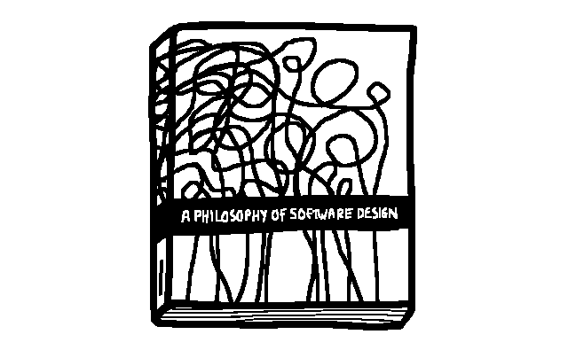

<!-- thumbnail: ./book_cover.gif -->
<!-- pinned: true -->
<!-- twitterSocialImage: ./book_cover.gif -->

# Reading notes: A Philosophy of Software Design



Here are a few notes on [A Philosophy of Software Design by John Ousterhout](https://www.amazon.co.uk/Philosophy-Software-Design-2nd-ebook/dp/B09B8LFKQL/ref=sr_1_1?crid=15RRQNVVGGPTM&keywords=A+Philosophy+of+Software+Design&qid=1659823295&sprefix=a+philosophy+of+software+design%2Caps%2C177&sr=8-1).

It's a small book at 178 pages that says what it needs to say simply and to the point.

This isn't a review of the book, for that check out [Pragmatics Engineer's great post and video](https://blog.pragmaticengineer.com/a-philosophy-of-software-design-review/). I'm just noting some parts that I relate to and that stand out to me.

## Shallow vs deep
<!-- TODO: Add stuff about shallow code? -->

## Different layer, different abstractions
> The interface of a class should normally be different from its implemention: the representions used internally should be different from the abstractions that appear in the interface.
<!-- p.50 -->


> Information leakage occurs when a design decision is reflected in multiple modules.

## Better together or better apart?

When reading this chapter, I was reminded of a little side project I had worked on.

> Bring pieces of code together is the most beneficial if they are closely related [...] Here are a few indications that two pieces of code are related:
> - They share information.
> - They are used together.
> - They overlap conceptually.
> - It is hard to understand one of the piece of code without looking at the other.
<!-- p.60 -->

It's a [small drawing tool](https://github.com/anthonyec/211203_wiggle_path/) that allows you to create vector networks out of nodes and connections, [like in Figma](https://youtu.be/5x2uHUB_pzw?t=30). But unlike Figma, you can animate the lines in the network, making them all shaky and wiggly.

After a messy prototype, I tried to "clean" things up by splitting the code into generalised classes. These included a class to create the HTML canvas and a class to render the drawing. Another 2 classes handled data structures such as the [graph](https://en.wikipedia.org/wiki/Graph_(abstract_data_type)) for connections between nodes and [spatial hashing](https://www.gamedev.net/tutorials/programming/general-and-gameplay-programming/spatial-hashing-r2697/) for [hit testing](https://en.wikipedia.org/wiki/Hit-testing).

Setting it up looked a bit like this:

```ts
const [_, context] = createCanvas2D();
const drawingGraph = createDrawingGraph();
const renderer = createRenderer(context, drawing);
const spatialStructure = createSpatialStructure();

spatialStructure.parseFromGraph(drawing);
```

But having these generalised classes made the project harder to work with. I had to switch between files constantly for simple features, and some parts relied on data from other bits. For example the `spatialStructure` needs to be updated each time the `drawingGraph` changes, which is often when drawing.  It could get out-of-sync easily if I'm not careful.

A better solution would be to instantiate a generalized module inside another because they are used together and share information. Or worry about generalising later. <!-- TODO: Reword -->

## Code comments

Many times in my career I've been told that  "good code is self documenting", so don't write comments and just write code good!

I've always felt that this was the wrong way to think about things but couldn't succinctly say why. But now I can, and it's one of my favourite quotes in the book:

> If users must read the code of a method in order to use it, then there is no abstraction.
<!-- p.97 -->

<!-- TODO: Add note about if other cant read it, it's not obvious -->

Of course you'll still need to write good comments and there's a whole chapter dedicated on how to do that. I really liked this rule of thumb when writing comments:

> A first step towards writing good comments is to use different words in the comment from those in the name of the entity being described.
<!-- p.105 -->

It's not a silver bullet and shouldn't be taken to the extreme. But it's a decent starting point to get you thinking about how best to explain something in code.
 <!-- I've already started putting it into practice. -->


<!-- TODO: Note on the difference between interface and implementation. And that commenting on just "why" isn't useful, and actually commenting on the "what" is a valid comment. Most people say it's not. Most people say "comment on why" and not "what". Say why that's not great advice>
