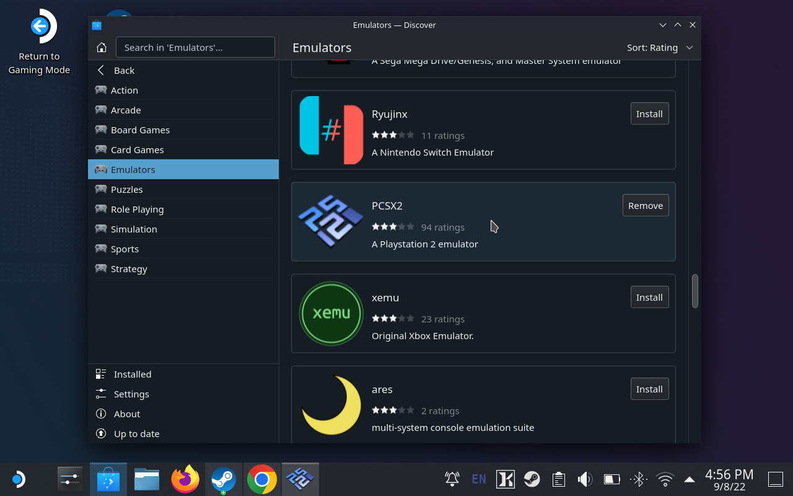
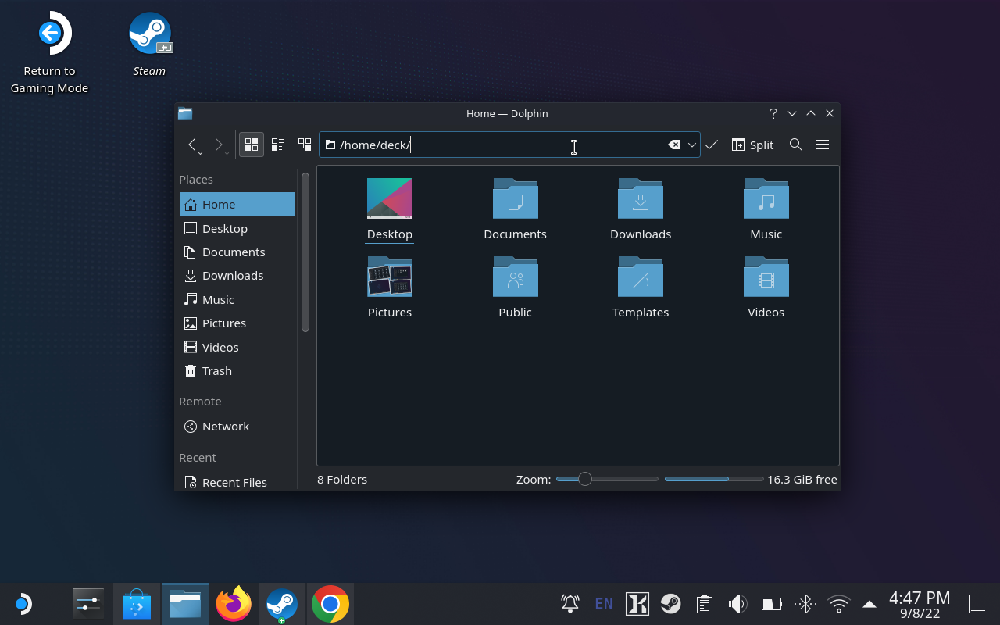
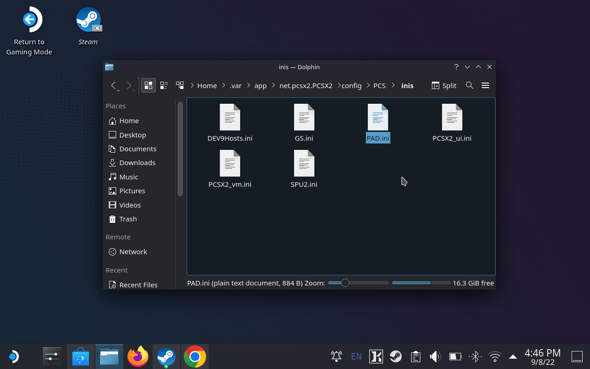
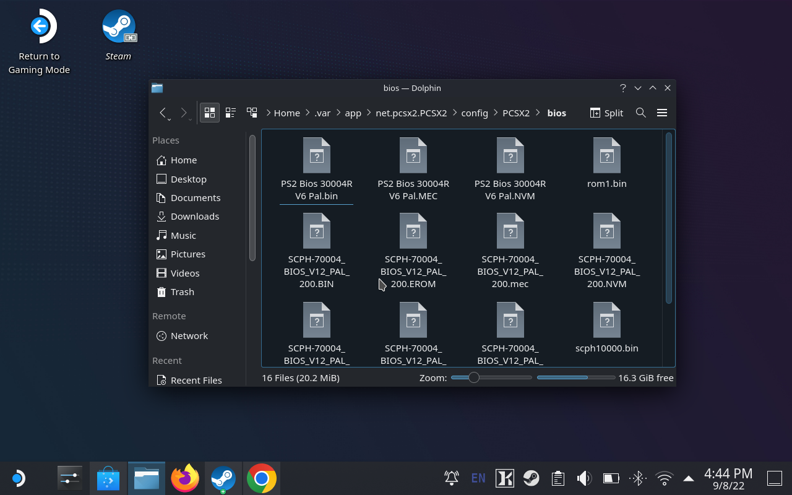
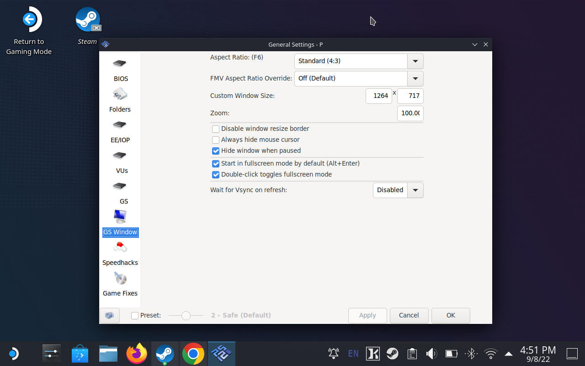
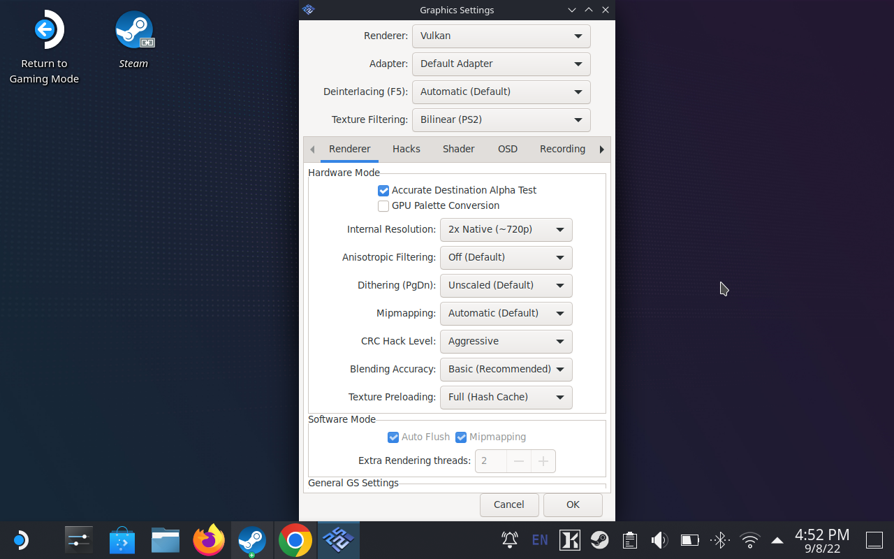
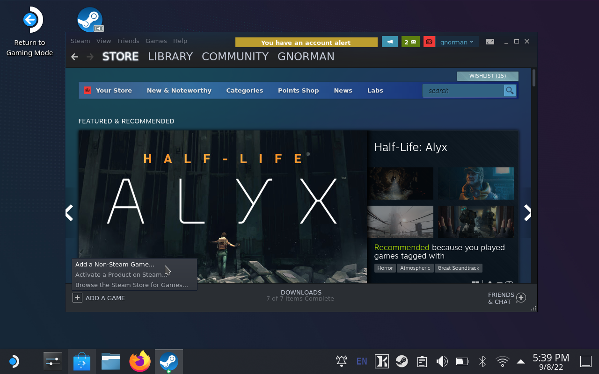
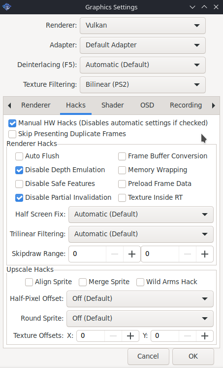
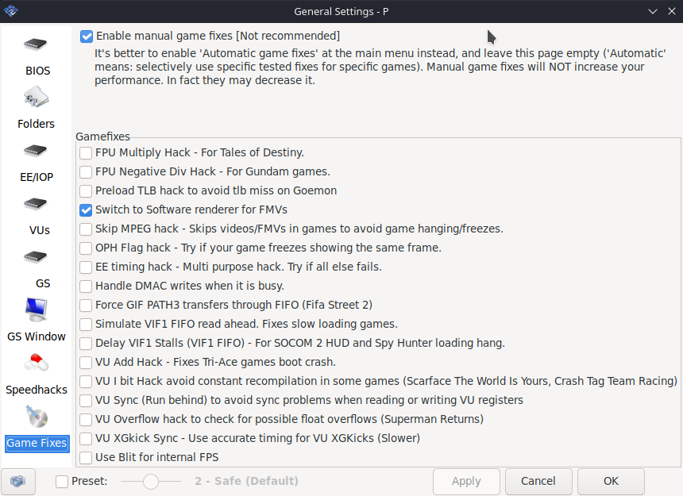

# My setup for playing PS2 games on the Steam Deck

Here's how I've setup PlayStation 2 emulation on my Steam Deck using PCSX2.

I've set this up mainly to play Silent Hill 2, so there may be additional things to tweak for other games.

## Download PCSX2

On the Deck, switch to the desktop. Do this by going to the `Steam menu > Power > Switch to Desktop`.

Open the Discover app. It's basically an app store.

Search for "PCSX2". Or navigate to via `Applications > Games > Emulators`.

Install PCSX2!

## Setup support for Steam Deck controls

⚠️ Before adjusting any settings, run PCSX2 and then quit. This will create the necessary files and folders for settings.

Download this <a href="PAD.ini" download>controller config file</a> called `PAD.ini`.

Message from our sponser: you can use [Salad Room](https://saladroom.net/) to copy over text and files easily.

The settings are located in hidden folders. It will be easier to navigate directly to folders using the address bar in the file explorer.

Open up the file explorer and go to: `/home/deck/.var/app/net.pcsx2.PCSX2/config/PCSX2/inis`.

Place the `PAD.ini` file into that folder.

## Install the PS2 BIOS

[Legally find](https://www.google.com/search?q=ps2+bios&oq=PS2+bios&sourceid=chrome&ie=UTF-8) and download a PS2 bios to the Steam Deck.

Once downloaded and extracted, copy all the BIOS files to this location: `/home/deck/.var/app/net.pcsx2.PCSX2/config/PCSX2/bios/`

Start up PCSX2 and click refresh list on the BIOS screen.

Select a BIOS! I chose the European version of the BIOS.

## Setup the basic settings

By default PCSX2 will use a small resolution for the window size. To fix this, in the menubar go to `Config > General Settings > GS Window` and set the custom window size to `1264 x 717`. <!-- TODO: find out why it;s this resolution. -->

_I have the preset slider disabled, but this is to [fix issues in Silent Hill 2](#fixes-for-silent-hill-2), and you can probably leave it enabled._

You can also choose aspect ratio to be 16:9 (widescreen). However, I've stuck to 4:3 for Silent Hill 2 because the cut-scenes and UI graphics are made for that aspect ratio, and look wrong in widescreen.

You'll also want check the box "Start in full-screen mode by default" if it's not set already.

## Additional settings for graphics

Go to `Config > Graphic Settings` and set the internal resolution to "2x Native (~720p)" which should match the Steam Deck's screen nicely.

## Add PCSX to your Steam Library

Before returning to Gaming Mode, you'll need to make PCSX2 accessible from your Steam Library.

Open Steam on the desktop and click "Add Game" and select "Add a Non-Steam Game...".

This will show a list of applications, select "PCSX2" and close the dialog. There will be the option for "PCSX2 Qt" but ignore that.

Now you can return back to Gaming Mode by clicking it on the desktop.

## Play games

To play PS2 games you'll need to [legally obtain](https://www.google.com/search?q=ps2+roms&oq=ps2+roms&sourceid=chrome&ie=UTF-8) a ISO file of the game.

Either in Gaming Mode or Desktop Mode, you can use Chrome to Download the ISO file onto the deck.

When you start PCSX2, in the menubar go to `System > Boot ISO` and select the ISO file from the dialog.

There may be ways to automatically starting the last loaded game, but I don't find it too much of a hassle to select the ISO each time I play.

## Fixes for Silent Hill 2

When using the flashlight, the games starts to lag as if  everything is in slow motion. To fix you'll need to change settings in 2 places.

First go to `Config > General Settings` and in the bottom left of the window, uncheck the box next to the preset slider.

Then go to `Config > Graphic Settings > Hacks` and enable hacks by checking the box "Manual HW Hacks (Disables automatic settings if checked)".

Then enable the following hacks:

- Disable Depth Emulation
- Disable Partial Invalidation

Also the pre-rendered cut-scenes ([FMVs](https://en.wikipedia.org/wiki/Full-motion_video)) were broken. I thought the first few seconds of the game were supposed to bne black with only sound, but then I realised it's probably not the art direction if every cut-scene starts like that.

To fix this go to `Config > General Settings > Game Fixes`, enable fixes by checking the box "Enable manual game fixes (Not recommended)".

Then enable the following fix:
- Switch to Software renderer for FMVs

I still see a slight glitchy flash when showing FMVs, but it's better than literal nothing.

Anyway, enjoy playing video games.
