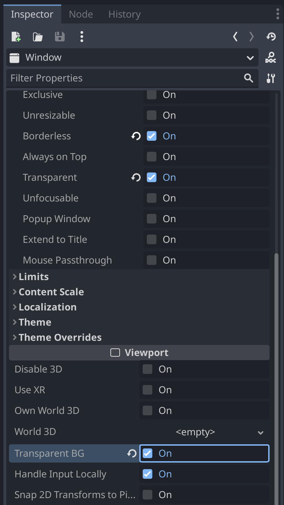

<!-- thumbnail: ./window_on_window.gif -->
<!-- twitterSocialImage: ./window_on_window.gif -->

# How to make transparent windows in Godot

⚠️ This guide is for Godot 4.

## Make a Window node transparent

1. Select the Window node you want to make transparent
2. In the Inspector panel, go to `Window > Flags`
3. Enable the `Borderless` toggle <a href="#footnote-1">[1]</a>
4. Scroll down to the Viewport section in the Inspector
5. Enable the `Transparent BG` toggle

## Make the main window transparent

This will make the desktop visible through the main window, unlocking the potential to make your own [BonziBuddy](https://en.wikipedia.org/wiki/BonziBuddy).

1. Open Project Settings
2. Ensure `Advanced Settings` is toggled on
3. Go to `Display > Window > Size`
4. Enable the `Transparent` toggle, this _allows_ a window to be transparent but does not make it transparent
5. Go to `Display > Window > Per Pixel Transparency`
6. Enable the `Allowed` toggle

5. Still in Project Settings, go to `Rendering > Viewport`
6. Enable the `Transparent Background` toggle

## Other resources

- [Making a fourth wall breaking 2D platformer with windows](https://github.com/geegaz/Multiple-Windows-tutorial#part-1---using-godot-4s-window)

## Footnotes

<ol>
  <li id="footnote-1">
    This will make <strong>embedded</strong> windows transparent. If you are using native non-embedded windows, then you'll need to enable <code>Transparent</code> instead of <code>Borderless</code>.
  </li>
</ol>

