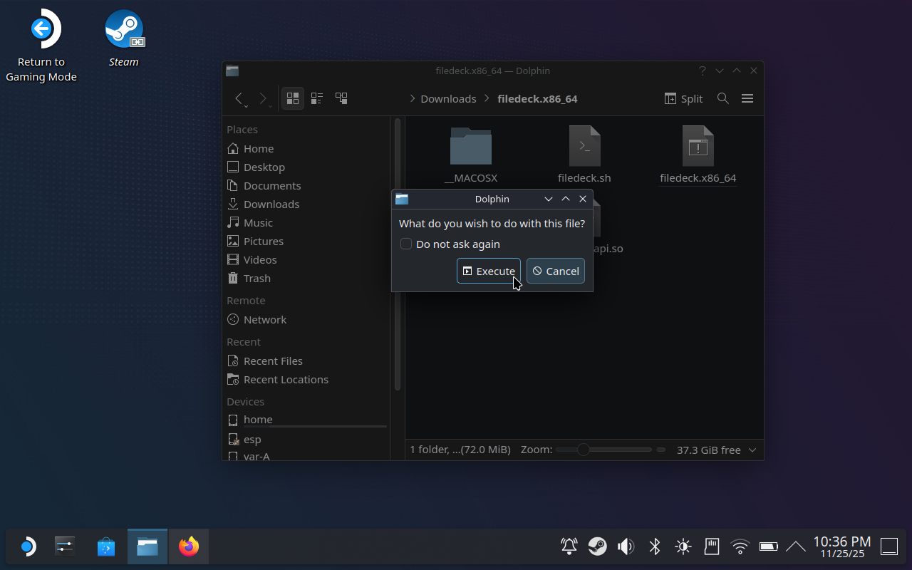
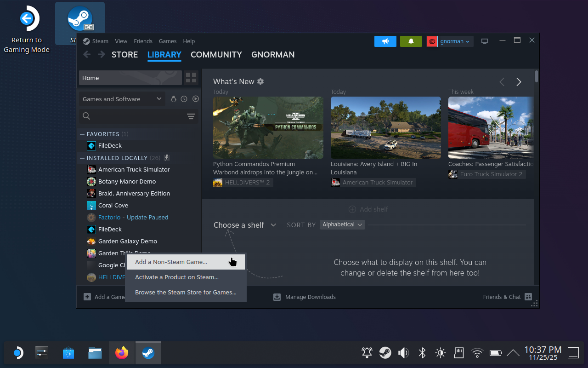
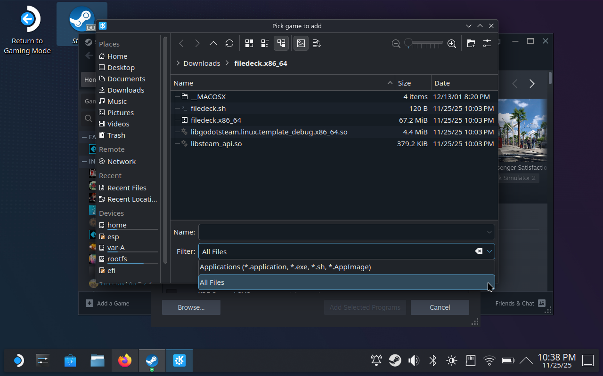
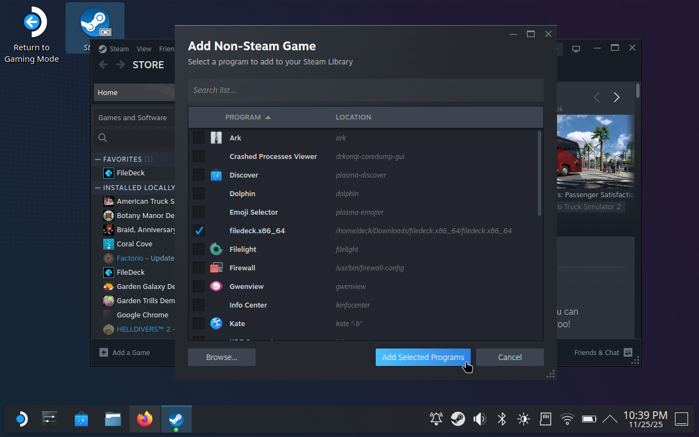
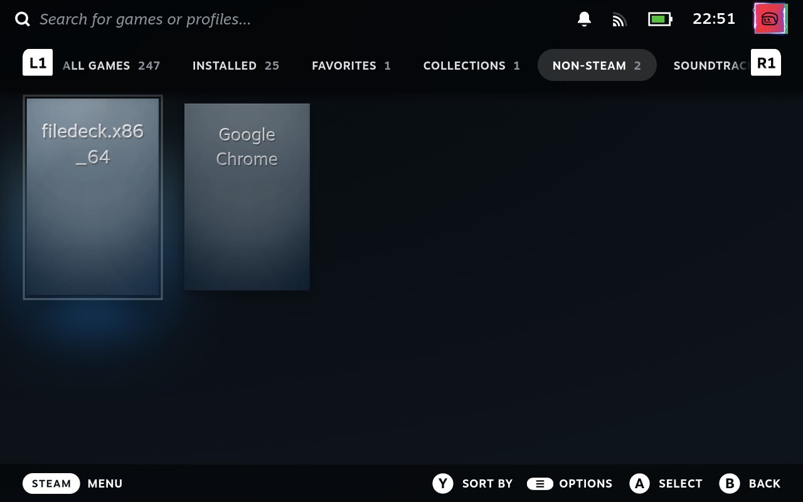

<!-- draft: true -->
<meta name="robots" content="noindex">

# How to install the FileDeck alpha

Welcome! You have chosen, or been chosen, to test out FileDeck on your fine Steam Deck device. Here is how to get it up and running.

On your Steam Deck, switch to Desktop and open this page in a browser.

🆒 Desktop Mode Top Tips (if you don't know already)

> - Use `STEAM + X` to print up the keyboard
> - Use `STEAM + Right Trackpad` to move the mouse
> - Use `STEAM + R2` to left click (primary action)
> - Use `STEAM + L2` for right click (context menu)

Visit [Salad Room](https://saladroom.net/) and enter the secret room code I gave you.

Download the `.zip` file in that room to your Steam Deck. Then extract the archive, it doesn't matter where but make a mental note.

Once extracted, run the executable `filedeck.x84_86`. A security warning will appear, select **Execute** to open FileDeck, then close it.

> ℹ️ Opening and closing FileDeck allows it to be executed later in game mode.

Open Steam in Desktop mode and select **Add a Game** > **Add a Non-Steam Game**.

In the add non-steam game dialog, select **Browse** to open a file selector.

Choose **All Files** in the dropdown and then navigate to where FileDeck was extracted.

Select the executable `filedeck.x84_86` then press **Add Selected Programs** to finish.

You can now return to Game Mode.

FileDeck should now appear in your Steam Library under the **Non-steam** category.

Report any issues, bugs and critique to me through whatever channel. And thank you for testing!
