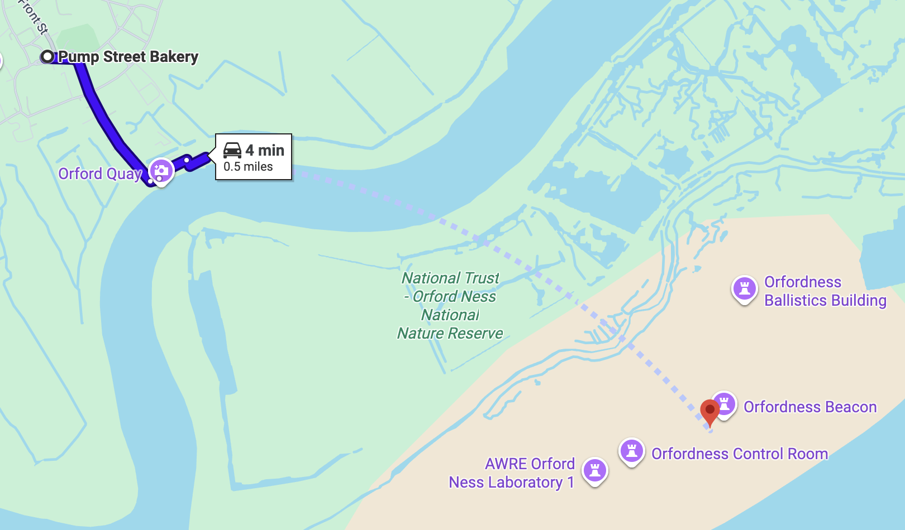
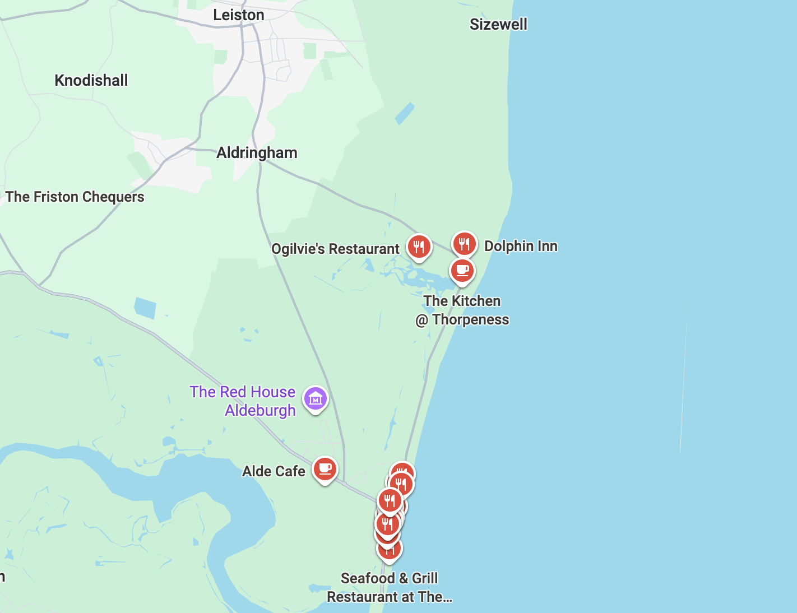

<meta name="robots" content="noindex">

<data sb:buildtime>
  {
    "hidden": true
  }
</data>

# Orford road trip

## Key Details
- 🗓️ Wednesday, 15th April 2026, same day the titanic finally sunk
- 📍 Meet at my [mother's home](https://maps.app.goo.gl/khddf4PUKHAALZwt5) at 09:30
- 🚗 Set off from mother's home at 10:00
- 🙂 Arrive at [Orford](https://maps.app.goo.gl/bcniTFnG91vxkRJw8) at about 13:00
- 🏠 Leave Orford at about 18:00
- 💤 Arrive back in London at about 20:30

## Key Details Expanded
+ The station to get to is [Anerley](https://maps.app.goo.gl/WntXo83dyVY5apx5A)
+ Louis and Anahita, I imagine we may all end up on the same West Croydon Overground, but let's see.
+ Maybe there are cool car tricks I can do to drop everyone off in London on the way back. That way it's easier for people to go home and  I can drive back to mother's home alone.

## Orford
First, we shall visit Orford. A small town south of Size Well B nuclear power plant.

The drive will be about [2hr 30min to 3hr](https://maps.app.goo.gl/PJniLxd2LE6YFqcE9), depending on conditions. We can stop for smoking breaks, toilet breaks and also snack breaks. It's a road trip after all!

I imagine we will arrive in Orford by 13:30, and will probably want food and coffee, which we can get at [Pump Street Bakery](https://maps.app.goo.gl/W7A4ubi6A61qNQ3dA). They have very good chocolate and Louis' sister works here sometimes.

## Orford Ness
After lunch, we can visit [Orford Ness](https://maps.app.goo.gl/dTpBPtY837Tdg7Sz9). It's a nature reserve and parts were formally used by the military.

I don't really know how we get there, Google Maps suggests doing a big giant hop. Maybe there's a boat? Or we approach it from the north.

## Size Well B

The main thing that inspired the trip, the UK's only pressurised water reactor! We can drive from Orford to there in [about 30mins](https://maps.app.goo.gl/Feri93dR1TchVQQ78).

We can hang around and take pictures. After that, maybe we can get dinner nearby. There seems to be a bunch of stuff near the sea.

